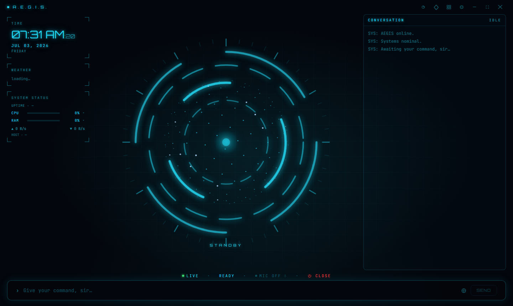
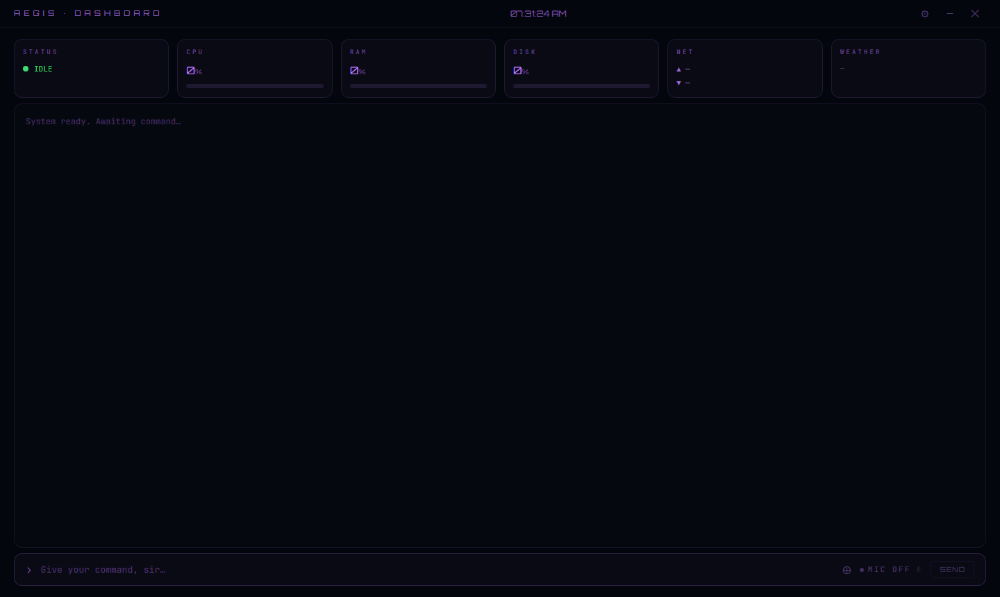
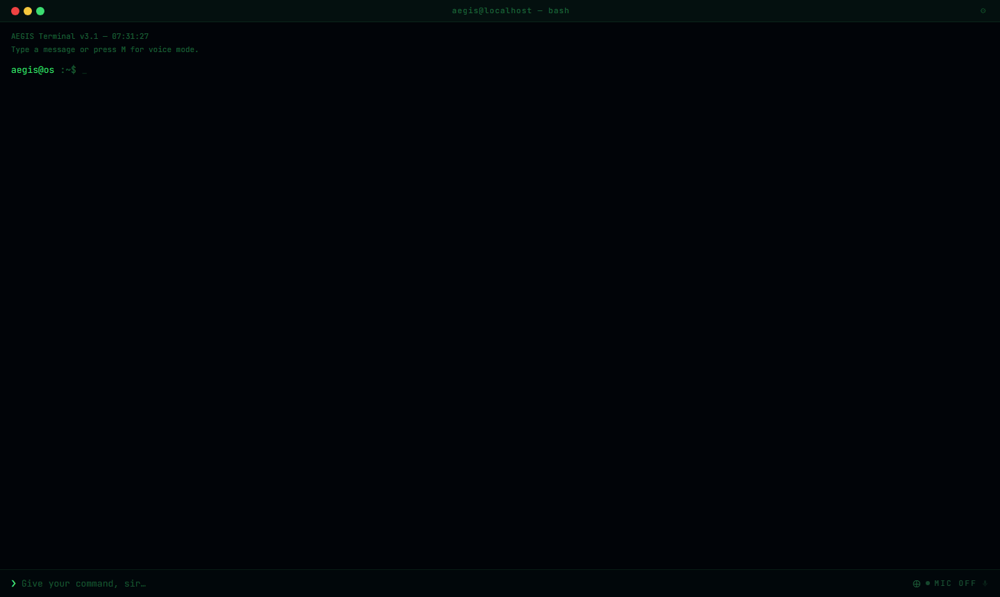

# AEGIS — Personal AI Assistant

> A Windows-native AI assistant. It listens, thinks, and acts.

[](https://github.com/Albis0/AEGIS/actions/workflows/test.yml)
[](https://github.com/Albis0/AEGIS/releases/latest)
[](LICENSE)



**AEGIS** is a desktop AI assistant for Windows: speech recognition, LLM reasoning, and **332 tools** wired to your actual machine. Talk or type — it controls your system, Spotify, Steam, smart home, files, screen, and more. Works with 8 AI providers (Groq, OpenAI, Anthropic, Gemini, xAI, DeepSeek, Mistral, Ollama) or with **no API key at all** in trial mode.

> [!WARNING]
> **Early-stage, under active development.** Some tools and features may be unreliable or break in certain situations. Known issues are fixed incrementally with each release. Treat it as an early-stage project, not a finished product — bug reports and PRs are very welcome.

> [!NOTE]
> **Built with AI ("vibe coded").** AEGIS was developed largely with AI coding assistants, shaped through iterative prompting rather than written entirely by hand. Shared openly for transparency; some corners may be rougher than a hand-crafted codebase.

---

## Features

| Category          | What it can do                                                                          |
| ------------------ | ---------------------------------------------------------------------------------------- |
| **AI core**        | 8 providers, streaming, tool calling (332 tools), per-model capability registry, deterministic tool routing, loop guard, self-healing |
| **Voice**          | Whisper STT (multilingual), TTS (Edge / ElevenLabs / Kokoro offline) with sentence-level streaming, wake-word + VAD, barge-in (ESC), live voice translation |
| **System**         | PowerShell, volume/brightness, windows, processes, disk cleanup, live telemetry (CPU/RAM/GPU/disk/battery/network) + alerts |
| **Files & media**  | Read/write/organize, duplicate finder, bulk rename, image tools, PDF text, local BM25 search (RAG), file chat |
| **Apps & web**     | Spotify (full Web API), Steam, OBS/VS Code/Discord/Notion plugins, web search (Tavily/Serper/DDG), URL reading, news & price tracking |
| **Vision & control** | Screenshot + AI analysis, Computer Use (mouse/keyboard from natural-language goals) with verification loop |
| **Automation**     | Scheduled tasks, conditional automations, macros, routines, agent mode, goal executor    |
| **Memory**         | User profile, facts, habits, session summaries, semantic recall, morning briefing, workspaces |
| **Smart home**     | Home Assistant (lights/locks/thermostats/scenes) + HA-less local device discovery (mDNS/SSDP) |
| **Security**       | DPAPI-encrypted keys, taint boundary for external content, destructive-action approval gate, boundary guard, RLS on every cloud table |
| **UI**             | 4 skin families × 4 variants (16 skins), 5 languages (TR/EN/DE/FR/ES), palette presets, custom CSS |
| **Access**         | Local network API (token-auth), browser UI with live sync, QR pairing for phones         |

Full feature history and open work: [ROADMAP.md](ROADMAP.md).

## Skins

16 skins across 4 families — a few of them:

| Dashboard | Terminal |
|---|---|
|  |  |

---

## Install (Users)

1. Download **`AEGIS-Setup-x.y.z.exe`** (installer, recommended) or the portable exe from the [latest release](https://github.com/Albis0/AEGIS/releases/latest).
2. Launch it and pick a mode in onboarding:
   - **Trial mode — zero keys needed.** Sign up with an email and start talking; requests go through a rate-limited proxy (daily request/token quota). Note: the trial backend runs on a free tier — after long inactivity the first request may take ~30 seconds while the server wakes up; AEGIS retries automatically.
   - **Advanced mode — your own key.** Paste a free [Groq](https://console.groq.com) API key (or any supported provider's) in the UI. Keys are stored DPAPI-encrypted on your machine and never leave it except to the provider you chose.
3. That's it — no `.env` file, no terminal. Auto-updates arrive through GitHub Releases.

Requires **Windows 10/11**.

> [!IMPORTANT]
> **Windows SmartScreen will warn you — this is expected and permanent.** AEGIS is a free, hobby open-source project and the executables are **not code-signed** (a signing certificate is a recurring cost that doesn't make sense here; see [SECURITY.md](SECURITY.md#unsigned-releases--how-to-verify-a-download)). Click **More info → Run anyway** if you trust the source. The warning is louder than usual because AEGIS legitimately uses screen capture, simulated input (Computer Use) and a self-updater — the same APIs security software watches for.
>
> Don't take a README's word for it — you can verify any release yourself:
> - the entire source is in this repo, and every release is built from a tagged commit by the public [GitHub Actions workflow](.github/workflows/release.yml);
> - scan the installer on [VirusTotal](https://www.virustotal.com) before running it;
> - or build it yourself: `bun run electron:build`.

---

## Development Setup

Requirements: **Windows 10/11** · **Node.js 18+** ([nodejs.org](https://nodejs.org)) · **Bun** ([bun.sh](https://bun.sh))

### 1. Clone and install

```bash
git clone https://github.com/Albis0/AEGIS.git
cd AEGIS
bun install
# .env is OPTIONAL — keys can be entered in-app (Settings → API Keys).
# Copy .env.example only if you prefer environment variables in development.
```

### 2. Pick an AI provider

Any supported provider's key works. For the fastest start, use **Groq** (free):

1. [console.groq.com](https://console.groq.com) → Sign up
2. **API Keys → Create API Key**
3. Copy the key — enter it on the onboarding screen on first launch

### 3. Start the app

```bash
bun run dev
```

### 4. Optional services

| Service                                       | What it's for               | Where to get it          |
| ----------------------------------------------| ----------------------------| --------------------------|
| Supabase                                      | Cloud sync, session storage | supabase.com              |
| ElevenLabs                                    | Realistic TTS voice         | elevenlabs.io             |
| Tavily / Serper                               | Advanced web search         | tavily.com / serper.dev   |
| OpenAI / Anthropic / Gemini / xAI / Mistral   | Alternative AI providers    | provider websites         |
| Ollama                                        | Run models locally           | ollama.com                |

Keys are entered under **Settings → API Keys**.

#### Offline TTS (Kokoro)

The Kokoro engine library ships with the app; its ~900 MB voice model does **not**. Select **Settings → Voice → TTS Engine → Kokoro** and the model downloads once to your user-data directory, then works fully offline.

---

## Spotify Integration

AEGIS uses the Spotify Web API (requires Premium):

1. [developer.spotify.com/dashboard](https://developer.spotify.com/dashboard) → Create an app
2. Add `http://localhost:17832/callback` as a Redirect URI
3. Enter the Client ID and Secret under **Settings → API Keys → Spotify**
4. Click "Connect to AEGIS" to complete OAuth authorization

---

## Usage

| Shortcut           | Action                                          |
| ------------------- | ------------------------------------------------ |
| `M`                 | Microphone: Off → Continuous → Wake-word → Off  |
| `Ctrl+L`            | Focus the message box                           |
| `Ctrl+Space`        | Command palette                                 |
| `ESC`               | Stop speaking (barge-in)                        |
| `F11`               | Fullscreen                                      |
| ⚙ (title bar)       | Settings panel                                  |

**Wake-word:** Say "Aegis, what's the weather?" or just "Aegis" and wait.

**Attaching files/images:** Use the `⊕` button or paste with `Ctrl+V` (after `Win+Shift+S`).

**Found a bug?** Use the in-app report form (**Settings → About → Report a bug**, screenshot attach supported) or open a [GitHub issue](https://github.com/Albis0/AEGIS/issues) — whatever details you have are welcome. For security issues, email is preferred over a public issue (see [SECURITY.md](SECURITY.md)). More help: [SUPPORT.md](SUPPORT.md).

---

## Build (Release)

```bash
bun run electron:build
```

Produces an installer `.exe` + portable build under `dist/`.
Note: embedding the exe icon requires Windows **Developer Mode** locally (symlink privilege for electron-builder's cache extraction); CI has it by default.

---

## Project Structure

```
electron/          # Main process (main.ts, agent-loop.ts, tools.ts, ipc/, etc.)
src/               # Renderer (React UI)
  components/
    skins/         # 4 families x 4 variants = 16 skins
    settings/      # Settings tab components
tests/             # Vitest tests + conversation harness scenarios
supabase/          # Edge Function + schema
```

For the trust model, agent-loop pipeline, and the invariants a PR must not break, see [ARCHITECTURE.md](ARCHITECTURE.md).

---

## Tech Stack

- **Electron 31** + **React 19** + **TypeScript** + **Vite** + **Tailwind CSS**
- **Groq SDK** (streaming, tool calling)
- **Supabase** (auth, DB, Edge Functions)
- **electron-updater** (auto-update via GitHub Releases)
- **msedge-tts** (free Edge TTS) · **kokoro-js** (offline TTS)
- Sentence-level streaming TTS with prefetch (speaks while the LLM is still writing)

---

## Security Model (summary)

- API keys stored with OS-level encryption (Windows DPAPI); no secrets ever bundled or committed
- The Supabase `service_role` key lives only in the Edge Function secret store; the bundled anon key is public-safe behind Row-Level Security
- External content (web pages, RSS, files) is taint-tracked — destructive tools escalate to mandatory approval once untrusted content enters the conversation
- Destructive actions go through an approval gate with per-run budgets
- The updater fails closed rather than shipping a credential to every install

Details, threat model, and how to verify unsigned releases: [SECURITY.md](SECURITY.md).

---

## Contributing

Contributions are welcome! Read [CONTRIBUTING.md](CONTRIBUTING.md) for setup, conventions, and the PR process, and follow our [Code of Conduct](CODE_OF_CONDUCT.md). Good starting points are listed in [ROADMAP.md](ROADMAP.md#open-work-priority-order).

---

## License

Licensed under the [Apache License 2.0](LICENSE).
